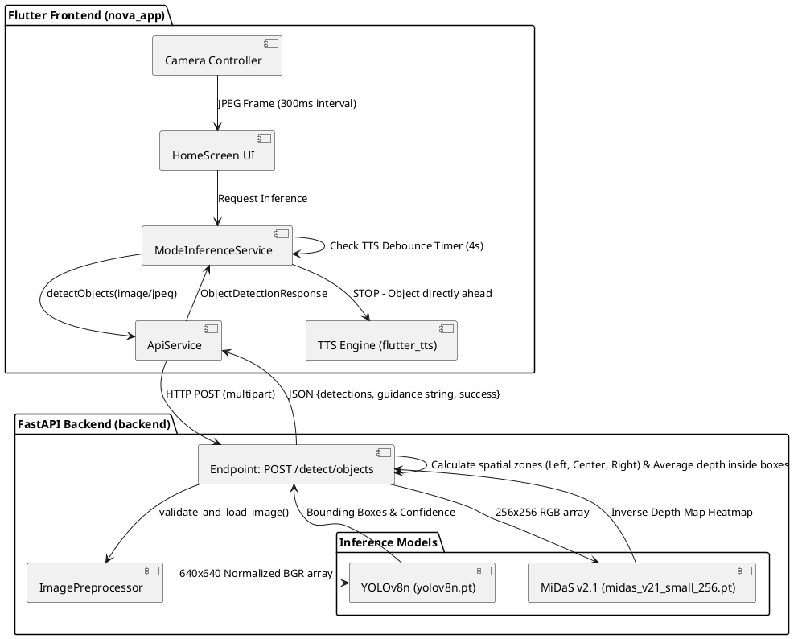
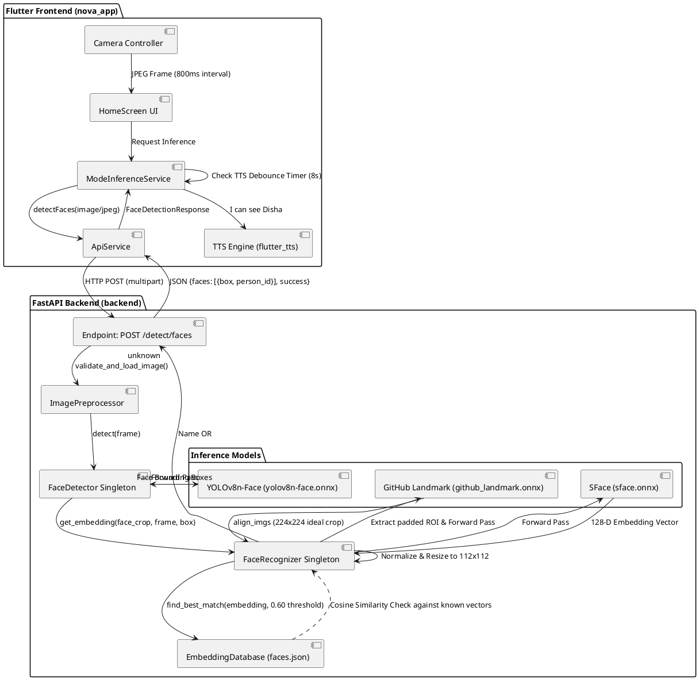
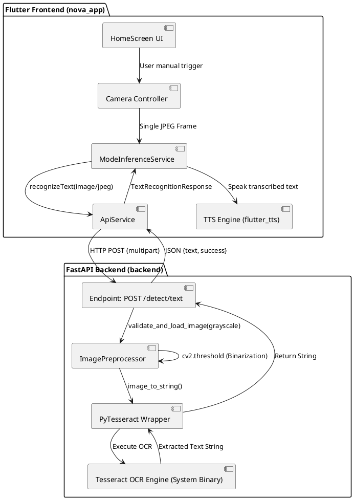

# NOVA: Comprehensive Project Report & Algorithmic Architecture

## 1. Abstract
NOVA (Navigation and Object Vision Assistant) is a real-time, AI-driven assistive mobility system engineered for visually impaired individuals. It integrates a Flutter-based mobile client with a high-performance FastAPI Python backend. The system offloads heavy Machine Learning (ML) inference to the edge/server, allowing the mobile device to act purely as an audio-visual sensor and feedback node. NOVA provides three core capabilities: Spatial Navigation (obstacle avoidance), Face Recognition (social awareness), and Optical Character Recognition (text reading). Additionally, it features a deeply integrated Android Native Emergency SOS system.

This document details the exact algorithms, machine learning models, pre/post-processing pipelines, and architectural decisions that power the NOVA system.

---

## 2. System Architecture & Communication Pipeline

The architecture is **stateless and frame-centric**. The mobile device does not perform any local ML inference. 

1. **Capture**: The Flutter camera controller captures JPEG frames at highly optimized intervals (e.g., 300ms for Navigation, 800ms for Recognition) to prevent network congestion.
2. **Transmission**: Frames are sent via HTTP `multipart/form-data` to specific FastAPI endpoints (e.g., `/detect/objects` or `/detect/faces`).
3. **Inference**: The FastAPI backend routes the frame through the globally loaded ML singletons in RAM. It mathematically extracts features, calculates spatial data, and formulates a structured JSON response.
4. **TTS Feedback**: The Flutter app receives the JSON payload, checks intelligent local debounce timers, and fires Text-To-Speech (TTS) auditory feedback to the user.

---

## 3. Core Machine Learning Models & Algorithms

### 3.1. Navigation & Obstacle Avoidance
This module combines 2D object detection with Monocular Depth Estimation.

#### A. YOLOv8n (Object Detection)
- **Model**: `yolov8n.pt` (Ultralytics Nano variant)
- **Pre-processing**: The backend decodes the JPEG byte-stream into a BGR OpenCV NumPy array. It is padded to square and resized to 640x640. Pixel values are normalized.
- **Inference**: YOLOv8 predicts bounding boxes `[x1, y1, x2, y2]`, confidence scores, and class labels for 80 COCO categories.
- **Post-processing & Spatial Zoning**: 
  The camera frame is divided into three uniform vertical zones: `Left` (x < 33%), `Center` (33% < x < 66%), and `Right` (x > 66%).
  The algorithm computes the horizontal center of each bounding box. If the centroid falls in the `Center` zone, the object is flagged as an imminent trajectory threat. Objects are filtered into a "Cautionary" list (e.g., chairs, cars, beds, people) or ignored if harmless (e.g., laptop on a desk).

#### B. MiDaS v2.1 Small (Depth Estimation)
- **Model**: `midas_v21_small_256.pt`
- **Algorithm Pipeline**:
  1. The frame is resized to 256x256, converted to RGB, and normalized using ImageNet statistics `(mean=[0.485, 0.456, 0.406], std=[0.229, 0.224, 0.225])`.
  2. The model outputs a continuous relative inverse depth map (values are highest for objects closest to the camera lens).
  3. The raw depth map is normalized to a `0.0` to `1.0` scale.
  4. **Bounding Box Depth Extraction**: For each cautionary object detected by YOLOv8, the backend extracts the exact corresponding sub-region tensor from the MiDaS depth map. It calculates the average pixel intensity within this bounding box.
  5. **Risk Aggregation**: If a "Center" zoned object has an average depth intensity > `0.62` (scale inverted to distance < `0.38`), a critical `STOP - [Object] directly ahead` command is generated.

### 3.2. Face Recognition & Registration Pipeline
This module uses a highly sophisticated cascade of three distinct neural networks.

#### A. YOLOv8n-Face (Detection)
- **Model**: `yolov8n-face.onnx`
- Scans the environment exclusively for human faces, resisting false positives from background shapes. Outputs a highly precise `[x1, y1, x2, y2]` bounding box.

#### B. GitHub Landmark Model (Alignment)
- **Model**: `github_landmark.onnx`
- **Algorithm**: Face embedding models (like SFace) are highly sensitive to pose. If a face is tilted, the embedding mathematically drifts.
  1. The backend extracts a generously padded (25%) crop of the face region based on the YOLO bounding box.
  2. The Landmark ONNX model identifies 106 focal points (eyes, nose, mouth corners) and internally calculates an Affine Transform Matrix to deskew the face.
  3. It outputs `align_imgs` — a 224x224 RGB image physically warped so the eyes lie perfectly horizontal.

#### C. SFace (Vector Extraction & Matching)
- **Model**: `sface.onnx`
- **Feature Extraction**: Takes the 112x112 resized aligned crop and outputs a **128-dimensional embedding vector**. This array of 128 floats represents the fundamental topography of the face.
- **Database Search**: The system performs a **Cosine Similarity** calculation between the live 128-D vector and all vectors stored in `faces.json`.
  - `Similarity = Dot(A, B) / (Norm(A) * Norm(B))`
  - If the similarity mathematically exceeds `0.60`, the identity is recognized.
- **Vector Registration**: When a user registers a new face, NOVA captures ~5-10 frames. It extracts the 128-D embedding for each frame and **averages them together** using an online running average formula, finally L2-normalizing the sum. This multi-sample average creates an incredibly robust, pose-agnostic master vector for that identity. To prevent identical twins or duplicated registers, a "Collapse Check" prevents saving if the new embedding shares `> 0.97` cosine similarity with an existing user.

---

## 4. Flutter Integration & Emergency Subsystems

The frontend relies heavily on Dart Isolates and asynchronous processing to keep the UI thread rendering smoothly at 60fps while handling intense background streams and native Android platform channels.

### 4.1. Intelligent Text-To-Speech (TTS) Debouncing
To prevent auditory overload for visually impaired users, NOVA implements stateful TTS memory maps:
- **Navigation Cooldown**: If the backend sends `<STOP - Person directly ahead>`, the Flutter app logs the timestamp. It will mute identical commands for the next 4 seconds. If the user clears the obstacle, it immediately announces `Path clear`.
- **Recognition Cooldown**: Recognized names (e.g., `I can see Jerin, 1 unknown face`) invoke an 8-second global freeze to stop continuous stuttering speech, allowing the user to converse naturally.

### 4.2. Android Native Emergency SOS System
A visual-assistance app must operate in life-threatening scenarios where touching a screen is impossible. NOVA integrates a native Java/Kotlin `AccessibilityService` that runs deep in the Android OS, completely independent of the Flutter UI lifecycle.

#### A. Hardware Triggers
- **Volume Key Pattern**: Using Android's `KeyEvent` interception, the Accessibility Service listens for users pressing **Volume Up then Volume Down** in quick succession. This bypasses the lock screen entirely.
- **Shake Detection**: A background `SensorManager` listens to the linear accelerometer. If a violent shaking motion (crossing a G-force threshold) is detected, it acts as a secondary trigger.

#### B. Emergency Execution Flow
When the hardware trigger is fired, the Native Android side uses a Flutter `MethodChannel` to instantly wake the Dart engine. The `EmergencyService` singleton completely halts all ML inference (cutting camera streams to free up RAM/Audio Focus) and begins a dual-action emergency protocol:
1. **SMS Broadcast**: Utilizes the Android Telephony API to immediately dispatch an SOS SMS string containing the distress flag to pre-configured ICE (In-Case of Emergency) contacts stored in the app's secure preferences.
2. **Direct Phone Call**: Invokes the `ACTION_CALL` intent to automatically dial the primary emergency contact or local authorities. The app transitions to the background during the call, suspending the camera cleanly, and awaits the OS resume lifecycle event to safely re-initialize the Navigation camera feed once the call is disconnected.

---

## 5. Architecture Diagrams

The following PlantUML diagrams illustrate the exact data pipelines and specific code components for NOVA's three primary operational modes.

### 5.1. Navigation Mode Pipeline

### 5.2. Face Recognition Mode Pipeline

### 5.3. Text Reading (OCR) Mode Pipeline

